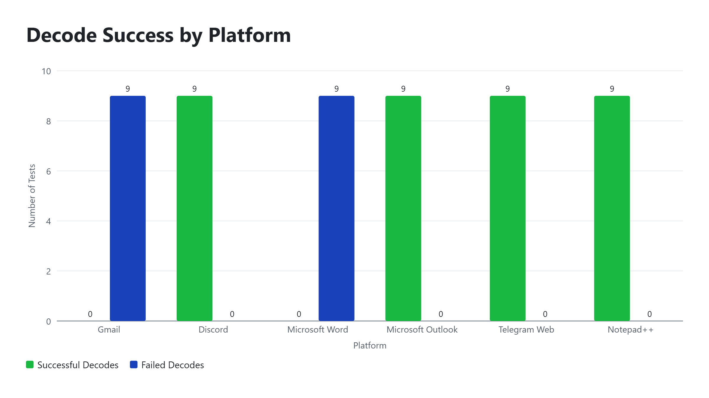
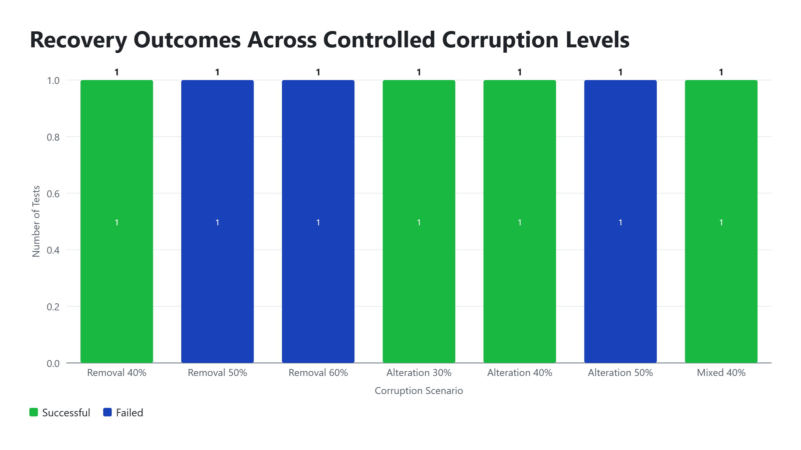

# Tristan Week 8
# Preliminary Results

## 1. Results Overview

The testing performed through Week 8 produced preliminary results in two primary areas:

* Platform compatibility and preservation of zero-width Unicode characters.
* Recovery performance under controlled corruption scenarios.

The results show that platform behavior can significantly affect whether the hidden zero-width payload is preserved and successfully decoded. The recovery testing also demonstrated improvements after the introduction of the five-copy recovery approach, while identifying limitations under higher levels of controlled corruption.

---

## 2. Platform Compatibility Results

### 2.1 Overall Platform Testing

Overall platform testing through Weeks 3-5 demonstrated significant differences in how applications preserved the project's zero-width Unicode payload. Some platforms consistently preserved the encoded characters and allowed the hidden message to be properly decoded, while others removed or altered portions of the payload, resulting in decreased survival rate and decode failures. Those results demonstrate how platform behavior is an important factor in the reliability of the steganography system and that successful encoding alone does not guarantee successful recovery after transferring the encoded text between platforms.

Across Weeks 3-5, testing consisted of 63 individual test cases. 9 in the local encoder/decoder tests conducted during Week 3 and 54 platform-transfer tests conducted between Weeks 4-5.

Week 3 tested the encoder and decoder system in the local python environment. It included 9 tests using the teams agreed test case messages. All 9 tests passed through the encoder and successfully decoded.
Week 4 tested three platforms, Gmail, Discord, and Microsoft Word. Each platform tested received 9 tests, one for each test message. Resulting in 27 tests in total. 
Week 5 also tested three platforms, Microsoft Outlook, Telegram Web, and Notepad++. Like Week 4, each platform received 9 tests, one for each of the test case messages. Resulting in 27 tests conducted overall.

Each set of testing on the platforms revealed how different platforms handle and preserve hidden zero-width Unicode characters.

Specifically during Week 4 we saw that:

* Gmail survival rates ranged from 42.11% to 50.63%. Each Gmail test failed with an incomplete or malformed byte block error.

* Discord preserved all zero-width characters in all nine tests. Every Discord payload decoded successfully and matched the original message.

* Microsoft Word survival rates ranged from 42.11% to 50.63%. Each Microsoft Word test failed with an incomplete or malformed byte block error after the save, close, reopen, and copy workflow.

Whereas during Week 5 we saw that Microsoft Outlook, Telegram Web, and Notepad++ preserved all encoded zero-width characters. 

### 2.2 Platform-Specific Results

This section compares the results observed across the platforms tested during Weeks 4-5. Specifically going over the important pieces of each platform test and then ending with an overall comparison.

#### Gmail

During Week 4 testing of the Gmail platform we conducted 9 tests. After completing all 9 tests we saw survival rates ranging from 42.11% to 50.63%.

All 9 tests when attempting to decode ran into `incomplete or malformed byte block` error. Resulting in decode failures for all 9 tests. This indicates that enough of the zero-width Unicode payload was removed or corrupted to prevent the hidden messages from being successfully decoded.

#### Discord

The next platform we tested during Week 4 was Discord. It was also tested with all 9 of the same test case messages. The process of testing was encoding the hidden message onto the visible cover text, going into a text channel on discord pasting and sending the encoded message, then copying the sent message back to run through the decoder.

Discord successfully preserved the zero-width Unicode characters and resulted in survival rates of 100.00% for each test. Decoding was also successful for each test conducted.

#### Microsoft Word

Microsoft Word was the last platform tested during Week 4. It like the other two received 9 test messages. The workflow to test the platform was as follows:
get encoded message > paste into a blank Microsoft Word document > save the document and close it > reopen the document > copy the message > run through decoder

Similarly to Gmail, Microsoft Word consistently removed large portions of the zero-width Unicode characters. With survival rates similar to what was seen from the Gmail testing, ranging from 42.11% to 50.63%. Just like with the Gmail testing when attempting to decode the encoded messages the decode resulted in failures for all 9 test case messages.

#### Microsoft Outlook

During Week 5, the first platform that was tested was Microsoft Outlook. Just like in Week 4, the platform was tested using the same 9 test case messages.

All 9 tests were conducted and resulted in 100.00% survival rates. Each encoded message was then successfully decoded and matched the original message.

#### Telegram Web

Telegram was the second platform tested during Week 5 and showed similar results.

The 9 tests conducted resulted in 100.00% survival rates. Decoding was also a success for each test message.

#### Notepad++

Notepad++ was the third and final platform tested during Week 5. The workflow for this platform was similar to the workflow for Microsoft Word during Week 4. The encoded message would be pasted into a blank Notepad++ file, saved, closed, reopened, copied, and were run through the decoder.

The same 9 test case messages were used through the testing, each one resulting in 100.00% survival rate and decoding succeeding. 

#### Overall summary

The results of the platform testing conducted between Weeks 3-5 show the difference between environments that preserved the encoded zero-width payloads and environments that did not. Discord, Microsoft Outlook, Telegram Web, and Notepad++ all successfully preserved the encoded payloads and decoded the hidden messages successfully. Meanwhile Gmail and Microsoft Word removed or altered enough of the payload to prevent successful decoding. This variation indicates that platforms' handling of zero-width Unicode characters is a significant factor in the practical reliability of the system.

### 2.3 Week 8 Platform Results

During Week 8, an additional round of platform compatibility testing was conducted using the hidden message `CS481-WEEK8`. 

Five platforms were tested: 
* Microsoft Word
* Gmail
* Windows Notepad
* Browser Console
* Discord

Unlike the earlier Weeks 3-5 testing, the Week 8 platform tests used one representative test message per platform. The purpose of this testing was to expand platform coverage and verify whether or not the observed behavior during earlier testing remained consistent.

#### Microsoft Word
0 of the 206 zero-width characters were recovered, giving a 0.00% survival rate, and decoding failed with the following error message.
`no zero-width payload was found`

#### Gmail
25 of the 206 zero-width characters were recovered, giving a 12.14% survival rate, decoding failed with the following error message.
`payload contains an incomplete or malformed byte block`

#### Windows Notepad
206 of the 206 zero-width characters were recovered, giving a 100.00% survival rate, decoding succeeded. Recovered secret: `CS481-WEEK8`

#### Browser Console
206 of the 206 zero-width characters were recovered, giving a 100.00% survival rate, decoding succeeded. Recovered secret: `CS481-WEEK8`

#### Discord
0 of the 206 zero-width characters were recovered, giving a 0.00% survival rate, decoding failed with the following error message.
`no zero-width payload was found`

Windows Notepad and Browser Console were the only platforms in the Week 8 testing that successfully preserved and decoded the Week 8 test payload. Microsoft Word and Discord lost all zero-width Unicode characters and gave a "`no zero-width payload was found`" error message. Gmail only managed to recover 25 of the 206 zero-width Unicode characters, resulting in a "`payload contains an incomplete or malformed byte block`" error message when attempting to decode the retrieved message. 

### 2.4 Platform Compatibility Findings

The platform compatibility testing conducted across Weeks 3-5 and Week 8 demonstrates that different applications handle the zero-width Unicode characters differently. Platforms that preserved the encoded zero-width payload allowed the message to be successfully decoded, while platforms that removed or altered portions of the payload resulted in decode failures.

Across the Weeks 3-5 platform testing, Discord, Microsoft Outlook, Telegram Web, and Notepad++ preserved the encoded zero-width payloads in the tested messages and successfully decoded the hidden messages. In contrast, Gmail and Microsoft Word removed portions of the payload, resulting in decode failures.

The additional Week 8 testing produced similar results. Windows Notepad and Browser Console preserved all 206 of the encoded zero-width characters in the `CS481-WEEK8` test and successfully recovered the hidden message. Microsoft Word and Discord removed all zero-width characters, and Gmail only recovered 25 of 206 characters, and all three platforms failed to successfully decode the payload.

These results indicate that platform-specific handling of zero-width Unicode characters is an important factor in the practical reliability of the steganography system. Successful encoding does not guarantee successful recovery after the encoded text has been transferred through another application. The results also show that compatibility should be evaluated through testing rather than assumed based on the application's general handling of text.

---

## 3. Recovery and Corruption Testing Results

### 3.1 Week 5 Baseline Results

The team's original recovery system's performance was tested during Week 5 using four controlled corruption scenarios.

Those scenarios were:
* Approximately 30.00% removal
* 50.00% removal
* Approximately 30.00% Alteration
* Approximately 20.00% mixed removal and alteration

All controlled corruption scenarios failed to decode.
* ~30.00% removal resulted in 69.08% survival rate and failed
* 50.00% removal resulted in 50.00% survival rate and failed
* ~30.00% alteration resulted in 100.00% survival rate and failed
* ~20.00% mixed removal and alteration resulted in 79.83% survival rate and failed.

These baseline recovery tests demonstrate that the original recovery system was unable to successfully recover the hidden messages under any of the four tested controlled corruption scenarios.

### 3.2 Week 6 Improved Recovery Results

During Week 6, the team introduced and tested an improved recovery approach using five-copy repetition and majority voting. Tristan conducted six controlled recovery scenarios to evaluate the performance of the improved recovery system under different corruption conditions.

The six scenarios were:

* 10.00% removal
* 20.00% removal
* 30.00% removal
* 10.00% alteration
* 20.00% alteration
* 30.00% mixed removal and alteration

All six of Tristan's controlled recovery scenarios successfully recovered the original messages.

* 10.00% removal resulted in a 91.71% survival rate and successfully recovered the original message.
* 20.00% removal resulted in an 83.38% survival rate and successfully recovered the original message.
* 30.00% removal resulted in a 75.08% survival rate and successfully recovered the original message.
* 10.00% alteration resulted in a 100.00% survival rate and successfully recovered the original message.
* 20.00% alteration resulted in a 100.00% survival rate and successfully recovered the original message.
* 30.00% mixed removal and alteration resulted in an 87.56% survival rate and successfully recovered the original message.

These results demonstrated improved recovery performance compared with the Week 5 baseline under the controlled corruption scenarios tested. The improved recovery system successfully recovered all six messages tested during Week 6.

### 3.3 Week 7 Expanded Recovery Results

During Week 7, the improved five-copy recovery system was tested under higher levels of controlled corruption to further evaluate its recovery performance. Tristan conducted seven expanded recovery scenarios consisting of removal, alteration, and mixed removal and alteration.

The seven scenarios were:

* 40.00% removal
* 50.00% removal
* 60.00% removal
* 30.00% alteration
* 40.00% alteration
* 50.00% alteration
* 40.00% mixed removal and alteration

Four of the seven controlled recovery scenarios successfully recovered the original messages, while three scenarios failed.

Removal:

* 40.00% removal resulted in a 66.83% survival rate and successfully recovered the original message.
* 50.00% removal resulted in a 58.46% survival rate and failed to recover the original message.
* 60.00% removal resulted in a 50.15% survival rate and failed to recover the original message.

Alteration:

* 30.00% alteration resulted in a 100.00% survival rate and successfully recovered the original message.
* 40.00% alteration resulted in a 100.00% survival rate and successfully recovered the original message.
* 50.00% alteration resulted in a 100.00% survival rate but failed to recover the original message.

Mixed removal and alteration:

* 40.00% mixed removal and alteration resulted in an 83.41% survival rate and successfully recovered the original message.

The Week 7 results showed a transition from successful recovery at lower tested corruption levels to failed recovery at higher tested levels. Removal testing successfully recovered the message at 40.00% but failed at 50.00% and 60.00%. Alteration testing successfully recovered the message at 30.00% and 40.00% but failed at 50.00%. The 40.00% mixed removal and alteration scenario successfully recovered the original message.

### 3.4 Recovery Performance Findings

The recovery and corruption testing conducted during Weeks 5–7 showed a clear progression in the performance of the project's recovery system. The original recovery system tested during Week 5 successfully recovered 0 of the 4 controlled corruption scenarios. After the introduction of the five-copy repetition and majority-voting recovery approach, all 6 of Tristan's controlled Week 6 scenarios successfully recovered the original messages. During Week 7, the recovery system was tested at higher corruption levels, resulting in 4 successful recoveries out of 7 expanded scenarios.

The Week 7 results showed that recovery continued to succeed at some higher corruption levels but began to fail at higher tested levels. The 40.00% removal, 40.00% alteration, and 40.00% mixed removal and alteration scenarios successfully recovered the original messages, while the 50.00% and 60.00% removal scenarios and the 50.00% alteration scenario failed. Additional Week 7 boundary testing supported this transition by showing recovery at 35.00% and 40.00% distributed damage and rejection at 45.00% and 50.00% distributed damage for removal, alteration, and mixed corruption.

Overall, these results indicate that the five-copy recovery approach substantially improved recovery performance compared with the original Week 5 recovery system under the controlled corruption scenarios tested. The expanded Week 7 testing also identified a transition from successful to unsuccessful recovery as the level of distributed corruption increased. However these results should not be taken as proof of a maximum corruption tolerance. The tests used controlled corruption patterns and kept structural separator characters so the outcomes do not show how the recovery system would work when faced with random platform changes, heavy corruption, deletion of structural separators, damage to payload prefixes or the removal of all zero‑width characters.

---

## 4. Survival Rate and Decode Success

Survival rate and decode success were treated as separate measurements throughout the recovery testing.

### 4.1 Survival Rate Results

Survival rate was used to measure the percentage of zero-width Unicode characters that remained present after a corruption scenario. The survival rate was calculated by dividing the number of recovered zero-width characters after corruption by the original number sent, and multiplying the result by 100. 

The survival rate varied depending on the type and level of corruption applied. Removal scenarios directly reduced the number of zero-width characters remaining after corruption and therefore would lower the survival rate. For example, the approximately 30.00% removal test during Week 5 resulted in a 69.08% survival rate, while the 50.00% removal test resulted in a 50.00% survival rate. During the improved recovery testing, the 30.00% removal test in Week 6 resulted in a 75.08% survival rate, and the 40.00% removal test in Week 7 resulted in a 66.83% survival rate.

Alteration scenarios on the other hand could still produce a survival rate of 100.00% because the number of zero-width characters remained the same even though the values of some were changed. This occurred in the approximately 30.00% alteration test during Week 5 and the 50.00% alteration test during Week 7. Both tests had 100.00% survival rates but decoding still failed.

These results demonstrate that survival rate simply measures payload preservation rather than message recovery. A high survival rate does not equate or indicate that hidden message can be successfully decoded, particularly when survivng characters have been altered. 

### 4.2 Decode Success Results

Decode success was used to determine whether the recovery system could successfully reconstruct the original hidden message after a controlled corruption scenario. A test was considered successful when the decoder recovered the hidden message and the recovered message matched the original plaintext.

The original recovery system tested during Week 5 was unsuccessful in all four controlled corruption scenarios, resulting in 0 out of 4 successful recoveries. During Week 6, the improved five-copy recovery system successfully recovered the original messages in all six of Tristan's controlled scenarios, resulting in 6 out of 6 successful recoveries. During Week 7, the recovery system was tested under higher levels of corruption and successfully recovered 4 out of 7 messages, while 3 scenarios failed.

The Week 7 results showed that decode success decreased as corruption levels increased within the tested scenarios. Removal testing successfully recovered the message at 40.00% removal but failed at 50.00% and 60.00% removal. Alteration testing succeeded at 30.00% and 40.00% alteration but failed at 50.00% alteration. The 40.00% mixed removal and alteration test successfully recovered the original message.

These results demonstrate why decode success must be considered separately from survival rate. A zero-width Unicode payload may retain a high survival rate percentage while still failing to recover the hidden message if the characters were altered or corrupted and thus invalid for decoding. However, the recovery system may successfully reconstruct a message even when some zero-width characters have been removed.

Overall, survival rate simply describes how much of the encoded payload remained after corruption, while decode success measures whether the recovery system was actually able to reconstruct the intended hidden message.

---

## 5. Preliminary Findings

Based on the testing completed through Week 8, several preliminary findings were identified:

* Finding 1 — platform compatibility
    - Testing demonstrated that different applications handle the project's zero-width Unicode payload differently. Some platforms preserved the payload and allowed the hidden message to be decoded, while others removed or altered portions of the payload and caused decoding to fail.

* Finding 2 — differences in zero-width character preservation
    - The number of zero-width characters preserved after transferring encoded text varied between platforms. Some tested platforms preserved the entire payload, while others preserved only a portion or removed the payload entirely.

* Finding 3 — improvement from the five-copy recovery approach
    - The five-copy recovery approach substantially improved recovery performance under the controlled corruption scenarios tested. The original recovery system failed all four Week 5 scenarios, while the improved system successfully recovered all six of Tristan's Week 6 scenarios and four of seven Week 7 scenarios.

* Finding 4 — observed recovery limitations at higher corruption levels
    - The improved recovery system successfully handled several higher levels of controlled corruption, but failures were observed as corruption increased. In Week 7, the 50.00% and 60.00% removal scenarios and the 50.00% alteration scenario failed to recover the original messages.

* Finding 5 — importance of separating survival rate from decode success
    - Survival rate and decode success measure different aspects of system performance. Tests with 100.00% survival still failed to decode when the surviving zero-width characters had been altered, demonstrating that payload preservation alone does not guarantee successful message recovery.

Overall, these findings indicate that the reliability of the steganography system depends on both the behavior of the platform through which encoded text is transferred and the ability of the recovery system to handle corruption. The five-copy recovery approach improved performance under the controlled scenarios tested, but the Week 7 results also identified limits as corruption increased. These findings provide a basis for the continued testing and refinement of the system during the remainder of this project.

---

## 6. Figures and Supporting Evidence

### 6.1 Figure 1 — Platform compatibility matrix summarizing zero-width payload preservation and decode outcomes across platform testing conducted during Weeks 3–5 and Week 8.

| Testing Period | Platform          | Tests |           Survival Result | Decode Result | Compatibility  |
| -------------- | ----------------- | ----: | ------------------------: | ------------- | -------------- |
| Weeks 4–5      | Gmail             |     9 |              42.11–50.63% | 0/9           | Not Compatible |
| Weeks 4–5      | Discord           |     9 |                      100.00% | 9/9           | Compatible     |
| Weeks 4–5      | Microsoft Word    |     9 |              42.11–50.63% | 0/9           | Not Compatible |
| Weeks 4–5      | Microsoft Outlook |     9 |                      100.00% | 9/9           | Compatible     |
| Weeks 4–5      | Telegram Web      |     9 |                      100.00% | 9/9           | Compatible     |
| Weeks 4–5      | Notepad++         |     9 |                      100.00% | 9/9           | Compatible     |
| Week 8         | Microsoft Word    |     1 |           0.00% | 0/1           | Not Compatible |
| Week 8         | Gmail             |     1 | 12.14% | 0/1           | Not Compatible |
| Week 8         | Windows Notepad   |     1 |            100.00% | 1/1           | Compatible     |
| Week 8         | Browser Console   |     1 |            100.00% | 1/1           | Compatible     |
| Week 8         | Discord           |     1 |           0.00% | 0/1           | Not Compatible |

The matrix shows substantial differences in platform handling of the zero-width Unicode payload. Platforms that preserved the payload consistently resulted in decoding success, while platforms that removed or altered the zero-width character payload too severly resulted in decode failures. Week 8 testing expanded platform coverage and confirmed successful preservation in Windows Notepad and Browser Console. Meanwhile Microsoft Word, Gmail, and Discord either did not recover any, or enough, of the sent zero-width payload to allow for successful decoding.

### 6.2 Figure 2 — Decode Success by Platform

**Figure 2.** Decode success and failure across platform compatibility testing conducted during Weeks 4–5. Each platform was tested using nine encoded messages.

The results show a clear difference in decode performance between platforms. Discord, Microsoft Outlook, Telegram Web, and Notepad++ successfully decoded all nine test messages, while Gmail and Microsoft Word failed to decode all nine.

### 6.3 Figure 3 — Recovery Outcomes Across Controlled Corruption Levels

**Figure 3.** The figure shows how recovery success changed as the level and type of corruption increased during controlled testing.

The results show that recovery performance decreased as the severity of certain corruption scenarios increased. For removal, the 40.00% scenario successfully recovered the message, while the 50.00% and 60.00% scenarios failed. A similar transition was observed with alteration, where the 30.00% and 40.00% scenarios succeeded but the 50.00% scenario failed.

---

## 7. Limitations of the Preliminary Results

These results should be interpreted within the limitations of the testing performed so far.

* Testing was performed on a limited number of platforms and applications.
* Platform and browser/application versions were not consistently recorded for all earlier tests.
* Recovery testing used controlled/distributed corruption rather than uncontrolled real-world transformations.
* The recovery results represent the specific messages and corruption scenarios tested and should not be interpreted as a universal corruption tolerance.
* Survival rate alone does not indicate whether the hidden message can be successfully decoded.

---

## 8. Summary

The preliminary results demonstrate that platform compatibility and recovery performance are important factors in the reliability of the zero-width Unicode steganography system. Platform testing showed significant differences in how applications preserve or alter zero-width characters. Some platforms, including Discord, Microsoft Outlook, Telegram Web, Notepad++, Windows Notepad, and the Browser Console in the tested scenarios, preserved the hidden payload sufficiently for successful decoding, while Gmail and Microsoft Word produced unsuccessful recovery results. Week 8 testing further expanded platform coverage and confirmed that compatibility varies between applications.

The recovery testing also showed an improvement after the introduction of the five-copy repetition and majority-voting approach. The original recovery system failed all four Week 5 baseline corruption scenarios, while the improved system successfully recovered all six controlled scenarios tested in Week 6. Expanded Week 7 testing demonstrated successful recovery at several higher corruption levels, while failures occurred at 50% and 60% removal and 50% alteration in the tested scenarios.

These preliminary results indicate that the improved recovery approach provides better performance under the controlled corruption conditions tested, but recovery remains limited as corruption becomes more severe. The results will guide continued testing and development during the remainder of the project, including additional platform compatibility testing, further recovery testing, and refinement of the system's robustness against corruption and platform-specific behavior.