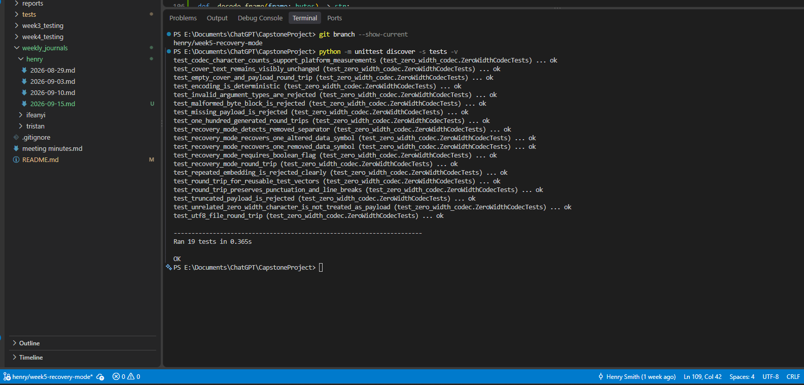
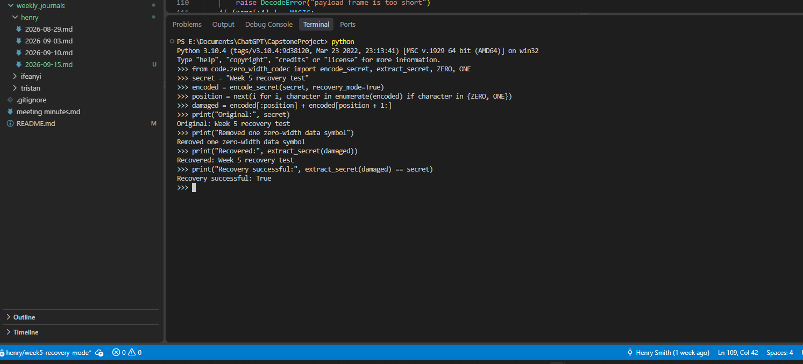

# Week 5 Recovery-Mode Testing

## Purpose

This document records the initial controlled tests for the three-copy repetition
mode added to the zero-width codec. The objective is to establish exactly what
the mode can and cannot recover before testing it on external platforms.

## Controlled results

| Test condition | Expected result | Automated result |
| --- | --- | --- |
| Untouched recovery-mode message | Exact secret recovery | Passed |
| One data symbol removed from a three-copy group | Exact secret recovery | Passed |
| One data symbol changed in a three-copy group | Exact secret recovery | Passed |
| One separator removed | Clear decoding failure | Passed |

## Interpretation

The method protects individual repeated data symbols through majority voting.
It does not repair structural damage to separators and cannot recover a payload
when a platform strips every zero-width character. Platform testing must record
which type of damage occurred before making a recovery claim.

## Reproduction command

```powershell
python -m unittest discover -s tests -v
```

The five recovery-specific tests are in `tests/test_zero_width_codec.py`.

## Test evidence

### Automated test suite



The screenshot shows the complete test suite finishing with `Ran 19 tests` and
`OK`, including all five recovery-mode tests.

### Manual damaged-payload recovery



The screenshot shows one zero-width data symbol being removed from an encoded
payload. The decoder still returns the original secret and reports
`Recovery successful: True`.
