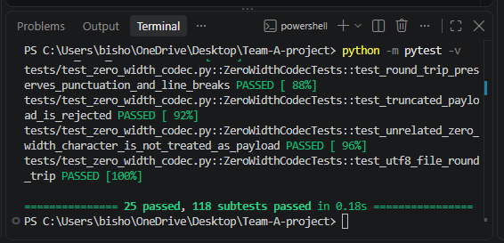
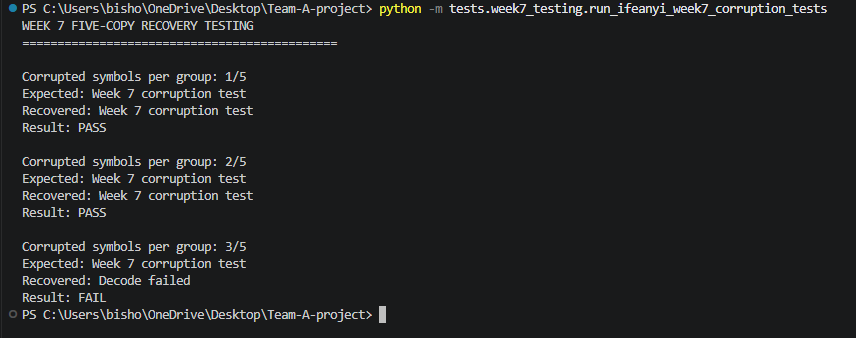

# Week 7 Progress Report

## Week 7 Objective

The main objective for Week 7 was to continue evaluating the robustness of the five-copy recovery method and determine its recovery limit under controlled corruption. The team continued building on the Week 6 recovery improvements through additional testing and documentation.

## Work Completed

### Ifeanyi Emeka

- Ran the complete automated test suite to establish the Week 7 baseline.
- Confirmed that 25 tests and 118 subtests passed successfully.
- Created a Week 7 corruption-testing script.
- Tested the five-copy recovery method with 1/5, 2/5, and 3/5 corrupted symbols per group.
- Confirmed successful recovery with 1/5 and 2/5 corrupted symbols.
- Identified recovery failure when 3/5 symbols were corrupted.
- Determined that the current five-copy recovery method can tolerate up to two corrupted symbols per group.
- Documented the testing results and captured screenshot evidence.
- Completed the Week 7 individual weekly journal.

### Henry Smith

- Continued evaluating the five-copy zero-width recovery implementation.
- Added higher-level corruption tests at 35%, 40%, 45%, and 50%.
- Tested removal, alteration, and mixed corruption at each level.
- Confirmed successful recovery through 40% distributed data-symbol damage.
- Confirmed safe rejection at 45% and 50% when the recovery capacity was exceeded.
- Added automated regression coverage and a reproducible limit-analysis script.
- Documented recovery outcomes, survival rates, interpretations, and limitations.
- Completed the Week 7 individual weekly journal.

### Tristan Koch

- Expanded the Week 7 controlled corruption and recovery testing to higher corruption levels.
- Created a separate Week 7 recovery-testing script without modifying the Week 6 testing scripts or implementation.
- Completed seven recovery tests covering removal, alteration, and mixed corruption scenarios.
- Tested approximately 40%, 50%, and 60% zero-width character removal.
- Tested approximately 30%, 40%, and 50% zero-width character alteration.
- Tested approximately 40% mixed removal and alteration.
- Recorded recovery results, survival rates, removed and altered character counts, and decoding failures.
- Confirmed successful recovery in four of the seven tests, including 40% removal, 30% alteration, 40% alteration, and 40% mixed corruption.
- Documented the three decoding-failure scenarios at higher corruption levels.
- Captured and organized terminal screenshot evidence for all seven tests.
- Created Week 7 testing-results documentation for comparison with Week 5 and Week 6 results.
- Completed the Week 7 individual weekly journal.

## Milestones and Deliverables

Week 7 milestones completed so far include:

- Completed baseline automated testing.
- Confirmed 25 tests and 118 subtests passed.
- Conducted controlled five-copy corruption testing.
- Successfully recovered the hidden message with 1/5 corrupted symbols.
- Successfully recovered the hidden message with 2/5 corrupted symbols.
- Confirmed recovery failure with 3/5 corrupted symbols.
- Identified the current recovery limit as two corrupted symbols per five-copy group.
- Created Week 7 testing documentation and screenshot evidence.
- Henry expanded corruption testing to 35%, 40%, 45%, and 50% and documented the recovery boundary and safe-failure behavior.
- Tristan completed seven expanded recovery tests covering removal, alteration, and mixed corruption scenarios.
- Tristan documented recovery and survival statistics and captured terminal evidence for all seven tests.
- All three team members completed their Week 7 individual journals.
- The team maintained testing evidence and documentation for comparison with previous weeks.

## Detailed Testing Evidence

### Baseline Automated Testing

The screenshot below shows the Week 7 baseline automated test results. All 25 tests and 118 subtests passed, confirming that the existing codec and recovery functionality were operational before the Week 7 corruption testing.

### Five-Copy Corruption Testing

The five-copy recovery method was tested at three corruption levels:

| Corrupted Symbols | Expected Result | Actual Result | Status |
|---|---|---|---|
| 1/5 | Secret recovered | Secret recovered | PASS |
| 2/5 | Secret recovered | Secret recovered | PASS |
| 3/5 | Recovery failure | Decoder could not recover original secret | FAIL |

The screenshot below provides direct evidence of the Week 7 corruption testing. The system successfully recovered the original secret when one or two symbols in each five-copy group were corrupted. Recovery failed when three symbols were corrupted because the corrupted symbols became the majority.

## Lessons Learned

Week 7 testing demonstrated the recovery limit of the current five-copy repetition method. Because recovery is based on majority voting, the original value can still be recovered when one or two of the five copies are corrupted.

When three of the five symbols are corrupted, the corrupted values become the majority and the decoder can no longer reliably recover the original secret. This testing established a clear tolerance limit for the current recovery method.

Henry's and Tristan's expanded testing provided additional insight into how the recovery method behaves under different types and levels of corruption. The results showed that survival rate alone does not guarantee successful decoding because altered zero-width characters may remain present while carrying incorrect values. The team also learned that the distribution of corruption is important, since concentrated damage within a five-copy group can exceed the recovery limit even when the overall corruption percentage appears manageable. These results provide a clearer understanding of the current recovery method's strengths and limitations.

## Progress Compared to Project Plan

The Week 7 work continued the robustness testing planned after the Week 6 recovery improvements. Week 6 demonstrated that repetition-based recovery could tolerate controlled corruption, while Week 7 tested the method more aggressively to determine its limit.

The successful baseline testing and controlled corruption testing provide measurable evidence of the current recovery capability. The project remains focused on evaluating and improving the robustness of the zero-width Unicode steganography system.

## Next Steps

The next phase will compare the Week 7 results with previous baseline and recovery testing. The team will use the identified recovery limits and failure conditions to guide Week 8 testing and robustness improvements. Testing will continue across different corruption patterns while documenting successful recovery conditions, limitations, and measurable results.