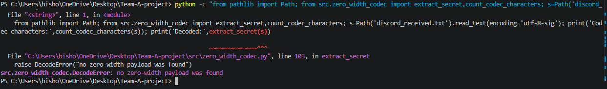

# CS481 – Team 1 Weekly Report 08

**Project:** Zero-Width Unicode Steganography with Social-Media Robustness Engineering
**Reporting Week:** Week 8 – Midterm
**Team Members:** Ifeanyi Emeka, Henry Smith, Tristan Koch

## 1. Weekly Progress and Accomplishments

During Week 8, Team 1 focused on midterm technical documentation, platform compatibility testing, prototype demonstration, and verification of the existing code.

### Ifeanyi Emeka – Team Leader
- Tested encoded messages using Gmail, Microsoft Word, Windows Notepad, Browser Console, and Discord.
- Recorded zero-width character survival and decoding results.
- Documented compatibility findings and limitations.
- Coordinated team contributions and reviewed merged pull requests.

### Henry Smith
- Prepared system architecture and codec documentation.
- Documented standard encoding and five-copy repetition-based recovery.
- Prepared a reproducible local prototype demonstration.
- Added demonstration evidence and updated technical documentation.

### Tristan Koch — Testing and Results Documentation

- Reviewed and consolidated platform compatibility and recovery testing results from Weeks 3–7.
- Prepared testing methodology documentation covering platform compatibility, controlled corruption, survival-rate calculations, and decoding success.
- Created preliminary-results documentation summarizing testing outcomes through Week 8.
- Developed two figures showing platform decoding success and failure and recovery performance under controlled corruption.
- Created a platform compatibility matrix comparing tested applications, character survival, and decoding results.
- Incorporated additional Week 8 testing results for Gmail, Microsoft Word, Windows Notepad, Browser Console, and Discord.
- Documented testing limitations and explained the differences between character survival and successful message recovery.

## 2. Testing and Verification

**Command:** `python -m pytest -v`

**Verified results:**
- 28 tests passed.
- 132 subtests passed.
- 0 failures.

### Platform Compatibility

| Platform | Zero-width characters preserved | Decode result |
|---|---:|---|
| Windows Notepad | 206 of 206 | Successful |
| Browser Console | 206 of 206 | Successful |
| Gmail | 25 of 206 | Failed |
| Microsoft Word | 0 of 206 | Failed |
| Discord | 0 of 206 | Failed |

The results show that zero-width Unicode steganography works in some applications but is not reliable across all platforms. Windows Notepad and Browser Console preserved the hidden message, while Gmail, Microsoft Word, and Discord altered or removed enough characters to prevent successful decoding. These findings demonstrate why platform compatibility testing is important to the project.

### Prototype Demonstration

Henry's documented demonstration verifies standard encoding and decoding, visible-cover preservation, five-copy recovery under a controlled 40% alteration pattern, and safe rejection at 45% alteration.

### Screenshots and Evidence

#### Figure 1: Week 8 Automated Tests

Figure 1 shows the automated testing results for the zero-width Unicode codec. The test run completed successfully with 28 tests passed, 132 subtests passed, and zero failures.

#### Figure 2: Midterm Prototype Demonstration

Figure 2 documents Henry's midterm prototype demonstration, including the encoding and decoding process and the repetition-based recovery testing.
  
  ### Figure 3: Discord Compatibility Test

Figure 3 shows the Discord compatibility test.
The decoder returned "no zero-width payload was found,"
indicating that the received message did not contain
a recoverable hidden payload. This demonstrates a
compatibility limitation in the tested Discord workflow.

## 3. Problems Encountered and Lessons Learned

Platform handling of zero-width Unicode characters varied significantly. Some applications removed the entire hidden payload, while Gmail preserved only part of it. The repetition-based recovery method handles limited, appropriately distributed damage but cannot restore a completely removed payload.

## 4. Progress Against the Semester Plan

During Week 8, Team 1 made progress toward the semester project milestones by completing midterm documentation, conducting additional platform compatibility testing, preparing a working prototype demonstration, and verifying the existing code through automated testing. The team successfully completed 28 automated tests and 132 subtests.

The team also documented platform compatibility limitations, reviewed recovery performance, and prepared supporting screenshots and testing results. These accomplishments support the project's midterm objectives. Further work will focus on improving compatibility, addressing recovery limitations, and preparing for the remaining semester milestones.

## 5. Individual Contributions and Repository Evidence

### Ifeanyi Emeka — Team Leader

Conducted Week 8 platform compatibility testing using Gmail, Microsoft Word, Windows Notepad, Browser Console, and Discord. Recorded zero-width character survival and decoding outcomes, documented testing limitations, and coordinated the integration of team contributions.

Evidence: `weekly_journals/ifeanyi/week8.md`, platform testing records, and Figure 3.

### Henry Smith — Encoder/Decoder Development

Prepared system architecture and codec documentation, demonstrated standard encoding and decoding, and documented the five-copy repetition-based recovery method. Provided prototype demonstration results and automated testing evidence.

Evidence: Henry's Week 8 journal and the prototype demonstration and testing artifacts in `tests/week8_testing/`.

### Tristan Koch — Testing and Results Analysis

Consolidated earlier platform and recovery testing results, prepared testing methodology and preliminary-results documentation, developed two figures, and created a platform compatibility matrix. Incorporated the additional Week 8 compatibility results into the midterm documentation.

Evidence: `weekly_journals/tristan/week8.md`, testing review, methodology, preliminary-results documentation, and supporting figures.

### GitHub Contributions

Henry's and Tristan's Week 8 pull requests were merged into the main branch. The repository contains the team's testing documentation, individual journals, and supporting evidence. Individual commit histories and pull requests provide additional evidence of contributions.

## 6. Meetings and Coordination

### Monday Meeting – October 5, 2026

**Attendees:** Ifeanyi Emeka, Henry Smith, and Tristan Koch.

The team reviewed Week 7 accomplishments, discussed the Week 8 Midterm Report requirements, and assigned individual responsibilities. Ifeanyi was responsible for coordinating and preparing the Midterm Report. Henry was assigned the system architecture, codec documentation, and prototype demonstration. Tristan was responsible for testing methodology, preliminary results, figures, and the compatibility matrix.

The team also discussed regression testing, platform compatibility testing, screenshot evidence, and the final review of the Midterm Report.

**Meeting Minutes:** `meeting_minutes/2026-10-05_week8.md`

### Friday Meeting – October 9, 2026

**Attendees:** Ifeanyi Emeka, Henry Smith, and Tristan Koch.

All three team members attended the Friday meeting and reviewed the completed Week 8 work and Midterm Report. The team discussed individual contributions, project documentation, and testing progress. The remaining report requirements and supporting evidence will be verified before final submission.

**Meeting Minutes:** `meeting_minutes/2026-10-09_week8.md`

## 7. Next Week's Plan

- Continue investigating platform compatibility and recovery limitations.
- Review the combined midterm report for technical accuracy.
- Address remaining issues and prepare subsequent project milestones.
