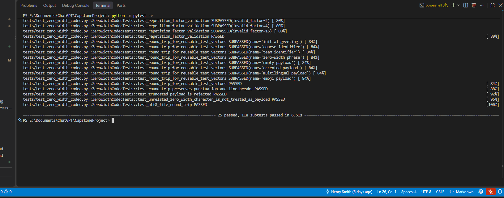
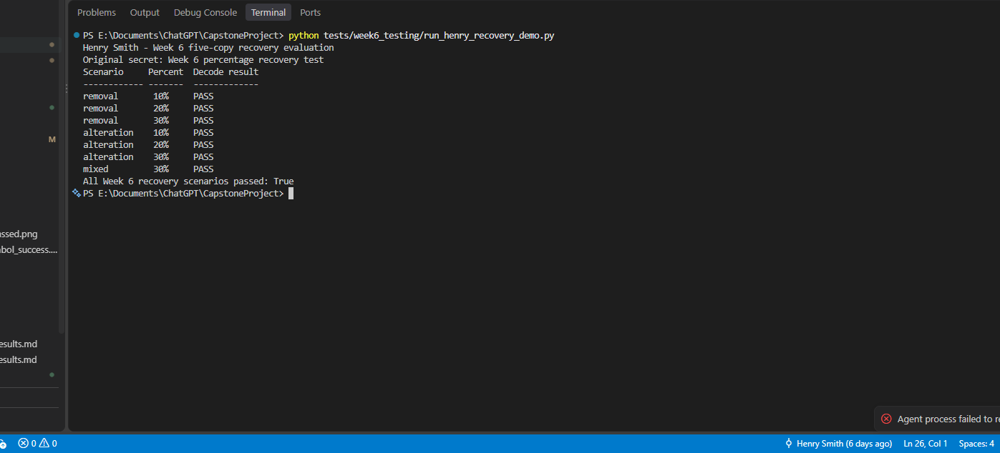

# Henry Smith - Week 6 Recovery Results

## Objective

Improve the Week 5 three-copy repetition method and evaluate recovery under
the Week 6 corruption percentages.

## Method selected

Repetition coding was selected instead of Reed-Solomon for this iteration.
It fits the existing bit-oriented codec, requires no external dependency, and
provides a direct comparison with the Week 5 baseline. The implementation now
supports configurable odd repetition factors from 3 through 15.

The Week 6 configuration repeats each bit five times. Majority voting recovers
the bit when up to two symbols in its group are removed or altered. Existing
three-copy Week 5 messages remain decodable.

## Controlled results

| Corruption | Percentage | Result |
| --- | ---: | --- |
| Data-symbol removal | 10% | PASS |
| Data-symbol removal | 20% | PASS |
| Data-symbol removal | 30% | PASS |
| Data-symbol alteration | 10% | PASS |
| Data-symbol alteration | 20% | PASS |
| Data-symbol alteration | 30% | PASS |
| Mixed removal and alteration | 30% total | PASS |

The damage was distributed across repeated data-symbol groups, with no group
receiving more than two damaged symbols. Structural `U+200D` separators were
preserved so the measurement isolates the correction capacity of five-copy
majority voting.

## Reproduction

Run the complete automated suite:

```powershell
python -m unittest discover -s tests -v
```

Run the concise percentage demonstration:

```powershell
python tests/week6_testing/run_henry_recovery_demo.py
```

## Limitations

- Five-copy mode has approximately five times the data-symbol overhead.
- It cannot recover when three or more symbols in the same five-copy group are
  damaged.
- Removed group separators, a damaged repetition prefix, and platforms that
  strip every zero-width character remain unrecoverable.
- CRC-32 validation remains enabled so uncorrected damage is rejected instead
  of being returned as a valid secret.

## Screenshot evidence

### Automated test suite



The automated test screenshot shows the complete suite finishing with
`25 passed, 118 subtests passed` and no failures.

### Percentage-corruption demonstration



The demonstration screenshot shows successful recovery for 10%, 20%, and 30%
data-symbol removal; 10%, 20%, and 30% alteration; and 30% mixed corruption.
The final result is `All Week 6 recovery scenarios passed: True`.
