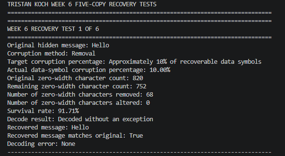
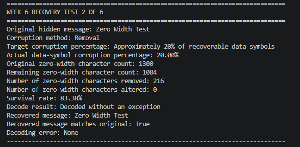
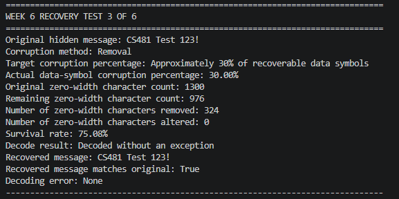
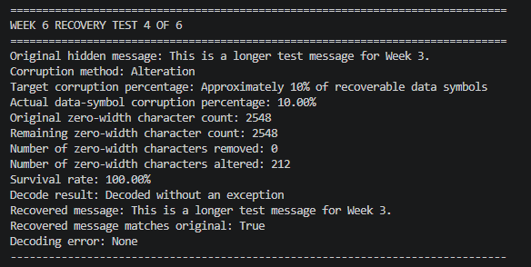
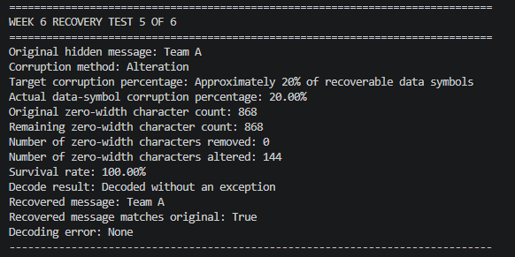
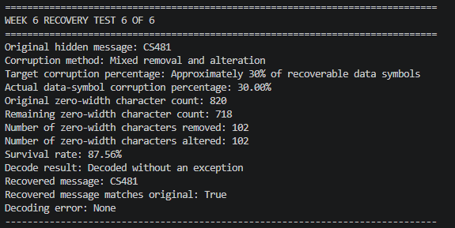

# Week 6 Tristan Recovery Testing Results

## Objective

The objective of Week 6 recovery testing is to evaluate whether the improved zero-width Unicode steganography codec can recover hidden messages after zero-width characters are intentionally removed or altered.

The Week 5 recovery-testing results are used as the baseline for comparison. Week 5 testing showed that the original codec failed to decode messages after zero-width characters were removed or altered.

Week 6 testing evaluates the improved codec under six controlled corruption scenarios:

* Approximately 10% zero-width character removal
* Approximately 20% zero-width character removal
* Approximately 30% zero-width character removal
* Approximately 10% zero-width character alteration
* Approximately 20% zero-width character alteration
* Mixed zero-width character removal and alteration

## Test Messages

The Week 6 recovery tests used six hidden messages. Four messages were reused from the Week 5 recovery-testing baseline to maintain consistency with the previous week's testing. Two additional messages were selected from the Week 4 test cases for the two additional Week 6 corruption scenarios, as requested by the team.

1. `Hello` — reused from the Week 5 baseline.
2. `Zero Width Test` — reused from the Week 5 baseline.
3. `CS481 Test 123!` — reused from the Week 5 baseline.
4. `This is a longer test message for Week 3.` — reused from the Week 5 baseline.
5. `Team A` — reused from the Week 4 test cases.
6. `CS481` — reused from the Week 4 test cases.

## Test Procedure

1. Update the project to the Week 6 version of the zero-width Unicode codec containing the five-copy recovery implementation.
2. Create an encoded hidden message using the improved codec with recovery mode enabled and a repetition factor of five.
3. Apply controlled corruption to the encoded zero-width data while preserving the structural separator characters.
4. Run six recovery scenarios:
   - Approximately 10% zero-width character removal.
   - Approximately 20% zero-width character removal.
   - Approximately 30% zero-width character removal.
   - Approximately 10% zero-width character alteration.
   - Approximately 20% zero-width character alteration.
   - Approximately 30% mixed removal and alteration.
5. Decode the corrupted payload using the recovery-enabled decoder.
6. Record the corruption percentage, original and remaining zero-width character counts, number of characters removed or altered, survival rate, decode result, recovered message, and whether the recovered message matches the original.
7. Capture a screenshot of the terminal output for each test as evidence.
8. Compare the Week 6 recovery results with the Week 5 recovery-testing baseline.

The six recovery tests were executed from the repository root using:

python tests/week6_testing/run_tristan_recovery_tests.py

The script performed the controlled corruption, recovery, and result reporting for each assigned test scenario.

## Information Recorded for Each Test

For each Week 6 recovery test, the following information was recorded:

- Test number.
- Original hidden message.
- Corruption method.
- Target corruption percentage.
- Actual data-symbol corruption percentage.
- Original zero-width character count.
- Remaining zero-width character count.
- Number of zero-width characters removed.
- Number of zero-width characters altered.
- Survival rate.
- Decode result.
- Recovered message.
- Whether the recovered message matched the original message.
- Any decoding error reported by the decoder.
- Screenshot evidence of the terminal output.

---

### Test 1 — 10% Zero-Width Character Removal

**Original hidden message:** `Hello`

**Corruption:** 10.00% of recoverable data symbols removed

**Zero-width characters:** 820 original → 752 remaining

**Characters removed:** 68

**Survival rate:** 91.71%

**Recovery result:** PASS

**Recovered message:** `Hello`

*Figure 1. Terminal evidence for Test 1. The controlled corruption removed 68 zero-width characters, resulting in a 91.71% survival rate. Despite the corruption, the recovery decoder successfully recovered `Hello`, and the recovered message matched the original.*

### Test 2 — 20% Zero-Width Character Removal

**Original hidden message:** `Zero Width Test`

**Corruption:** 20.00% of recoverable data symbols removed

**Zero-width characters:** 1,300 original → 1,084 remaining

**Characters removed:** 216

**Survival rate:** 83.38%

**Recovery result:** PASS

**Recovered message:** `Zero Width Test`

*Figure 2. Terminal evidence for Test 2. The controlled corruption removed 216 zero-width characters, resulting in an 83.38% survival rate. Despite the corruption, the recovery decoder successfully recovered `Zero Width Test`, and the recovered message matched the original.*

### Test 3 — 30% Zero-Width Character Removal

**Original hidden message:** `CS481 Test 123!`

**Corruption:** 30.00% of recoverable data symbols removed

**Zero-width characters:** 1,300 original → 976 remaining

**Characters removed:** 324

**Survival rate:** 75.08%

**Recovery result:** PASS

**Recovered message:** `CS481 Test 123!`

*Figure 3. Terminal evidence for Test 3. The controlled corruption removed 324 zero-width characters, resulting in a 75.08% survival rate. Despite the corruption, the recovery decoder successfully recovered `CS481 Test 123!`, and the recovered message matched the original.*

### Test 4 — 10% Zero-Width Character Alteration

**Original hidden message:** `This is a longer test message for Week 3.`

**Corruption:** 10.00% of recoverable data symbols altered

**Zero-width characters:** 2,548 original → 2,548 remaining

**Characters altered:** 212

**Survival rate:** 100.00%

**Recovery result:** PASS

**Recovered message:** `This is a longer test message for Week 3.`

*Figure 4. Terminal evidence for Test 4. The controlled corruption altered 212 zero-width characters while removing none, resulting in a 100.00% survival rate. Despite the corruption, the recovery decoder successfully recovered the original message, and the recovered message matched the original.*

### Test 5 — 20% Zero-Width Character Alteration

**Original hidden message:** `Team A`

**Corruption:** 20.00% of recoverable data symbols altered

**Zero-width characters:** 868 original → 868 remaining

**Characters altered:** 144

**Survival rate:** 100.00%

**Recovery result:** PASS

**Recovered message:** `Team A`

*Figure 5. Terminal evidence for Test 5. The controlled corruption altered 144 zero-width characters while removing none, resulting in a 100.00% survival rate. Despite the corruption, the recovery decoder successfully recovered `Team A`, and the recovered message matched the original.*

### Test 6 — 30% Mixed Removal and Alteration

**Original hidden message:** `CS481`

**Corruption:** 30.00% of recoverable data symbols corrupted through mixed removal and alteration

**Zero-width characters:** 820 original → 718 remaining

**Characters removed:** 102

**Characters altered:** 102

**Survival rate:** 87.56%

**Recovery result:** PASS

**Recovered message:** `CS481`

*Figure 6. Terminal evidence for Test 6. The controlled corruption removed 102 zero-width characters and altered another 102, resulting in an 87.56% survival rate. Despite the mixed corruption, the recovery decoder successfully recovered `CS481`, and the recovered message matched the original.*

---
# Week 6 Recovery Testing Comparison

## Purpose

The Week 5 recovery-testing results were used as the baseline for evaluating the improved five-copy recovery codec in Week 6. Week 5 testing demonstrated that the previous codec failed to recover the hidden messages after the tested zero-width character corruption scenarios.

Week 6 repeated recovery testing using the improved codec and expanded the testing to six controlled corruption scenarios involving zero-width character removal, alteration, and mixed corruption.

## Week 5 Baseline

The Week 5 recovery tests established the baseline for evaluating the improved recovery codec. The previous codec failed to recover the hidden message in each of the four tested corruption scenarios.

| Test | Hidden Message | Corruption Scenario | Result |
|---|---|---|---|
| 1 | `Hello` | 30% removal | **Decode failed** |
| 2 | `Zero Width Test` | 50% removal | **Decode failed** |
| 3 | `CS481 Test 123!` | 30% alteration | **Decode failed** |
| 4 | `This is a longer test message for Week 3.` | 20% removal + 20% alteration | **Decode failed** |

All four Week 5 recovery scenarios resulted in decode failure.

## Week 6 Results

The improved five-copy recovery codec was evaluated using six controlled corruption scenarios involving zero-width character removal, alteration, and mixed corruption.

| Test | Hidden Message | Corruption Scenario | Survival Rate | Result |
|---|---|---|---:|---|
| 1 | `Hello` | 10% removal | 91.71% | **PASS** |
| 2 | `Zero Width Test` | 20% removal | 83.38% | **PASS** |
| 3 | `CS481 Test 123!` | 30% removal | 75.08% | **PASS** |
| 4 | `This is a longer test message for Week 3.` | 10% alteration | 100.00% | **PASS** |
| 5 | `Team A` | 20% alteration | 100.00% | **PASS** |
| 6 | `CS481` | 30% mixed removal + alteration | 87.56% | **PASS** |

All six Week 6 recovery scenarios successfully recovered their original hidden messages.

## Comparison

The Week 5 baseline showed that the previous codec failed to recover the hidden messages under all four tested corruption scenarios. In contrast, the improved five-copy recovery codec successfully recovered the original hidden message in all six Week 6 scenarios.

Week 6 demonstrated successful recovery under approximately 10%, 20%, and 30% zero-width character removal, as well as approximately 10% and 20% alteration and a 30% mixed removal-and-alteration scenario.

The Week 6 results therefore demonstrate improved recovery behavior compared with the Week 5 baseline. However, the Week 6 scenarios were not identical to all four Week 5 scenarios, so the results should be interpreted as evidence of improved recovery capability across a broader set of controlled corruption conditions rather than as a direct one-to-one comparison of every test.

## Overall Result

Week 5 established a baseline in which all four tested corruption scenarios resulted in decode failure. Week 6 testing of the improved five-copy recovery codec resulted in successful recovery for all six tested corruption scenarios.

The results provide evidence that the added redundancy and recovery mechanism improved recovery under the controlled corruption scenarios tested in Week 6