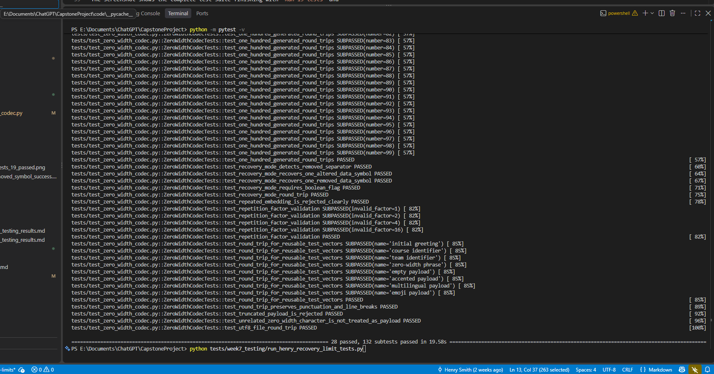
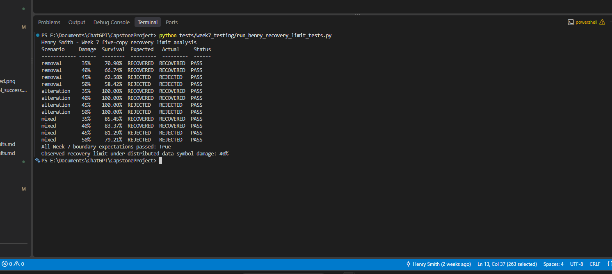

# Henry Smith - Week 7 Recovery-Limit Results

## Objective

Continue testing the five-copy repetition method at higher corruption levels
and determine its controlled recovery limit.

## Method

The test encodes the same hidden message with five copies of each bit and then
distributes damage across the repeated data-symbol groups. Structural
`U+200D` separators remain intact so the evaluation isolates the majority-vote
correction limit.

The scenarios apply 35%, 40%, 45%, and 50% data-symbol damage using removal,
alteration, and an alternating mixture of both. Recovery is expected through
40%, where each group receives no more than two damaged symbols. At higher
levels, at least one group exceeds the two-symbol correction limit.

## Results

| Corruption | Damage | Zero-width survival | Expected | Actual | Status |
| --- | ---: | ---: | --- | --- | --- |
| Removal | 35% | 70.90% | Recovered | Recovered | PASS |
| Removal | 40% | 66.74% | Recovered | Recovered | PASS |
| Removal | 45% | 62.58% | Rejected | Rejected | PASS |
| Removal | 50% | 58.42% | Rejected | Rejected | PASS |
| Alteration | 35% | 100.00% | Recovered | Recovered | PASS |
| Alteration | 40% | 100.00% | Recovered | Recovered | PASS |
| Alteration | 45% | 100.00% | Rejected | Rejected | PASS |
| Alteration | 50% | 100.00% | Rejected | Rejected | PASS |
| Mixed | 35% | 85.45% | Recovered | Recovered | PASS |
| Mixed | 40% | 83.37% | Recovered | Recovered | PASS |
| Mixed | 45% | 81.29% | Rejected | Rejected | PASS |
| Mixed | 50% | 79.21% | Rejected | Rejected | PASS |

## Interpretation

The controlled recovery boundary is 40% distributed data-symbol damage. This
matches the five-copy repetition code's mathematical limit: majority voting
can correct two damaged copies out of five. At 45% and 50%, some groups contain
three damaged copies, so reliable recovery is impossible.

The decoder handled above-limit corruption safely. It raised a `DecodeError`
because of an invalid group, frame, or checksum instead of returning corrupted
text as though it were valid.

Alteration does not reduce the zero-width character count, so its survival rate
remains 100% even when recovery fails. This demonstrates why survival rate and
successful decoding must be reported separately.

## Reproduction

Run the complete regression suite:

```powershell
python -m pytest -v
```

Run the Week 7 limit analysis:

```powershell
python tests/week7_testing/run_henry_recovery_limit_tests.py
```

## Limitations

- These are controlled, distributed data-symbol corruption tests.
- Concentrated damage can exceed a group's limit at a lower overall percentage.
- Separator deletion, prefix damage, and complete zero-width stripping remain
  outside the recovery capability.
- Five-copy mode still has approximately five times the data-symbol overhead.

## Screenshot evidence

### Automated regression suite



The screenshot shows the complete regression suite finishing with
`28 passed, 132 subtests passed` and no failures.

### Recovery-limit analysis



The screenshot shows all twelve boundary scenarios producing their expected
outcomes. Recovery succeeds at 35% and 40%, while 45% and 50% corruption are
safely rejected. The observed controlled recovery limit is 40%.
