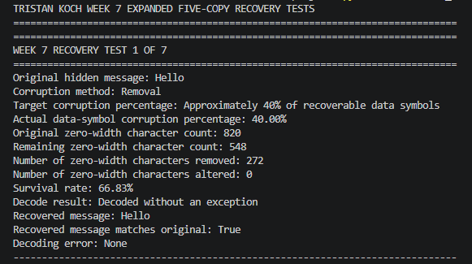
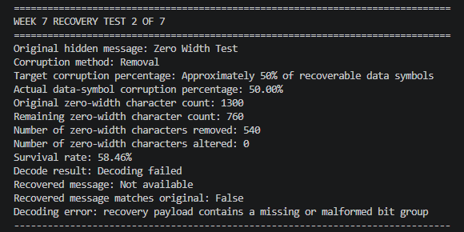
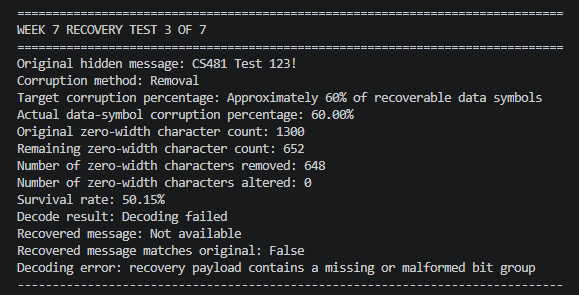
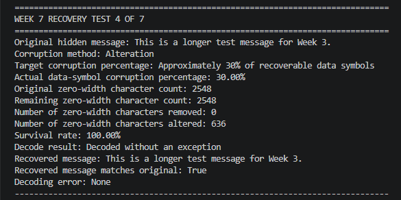
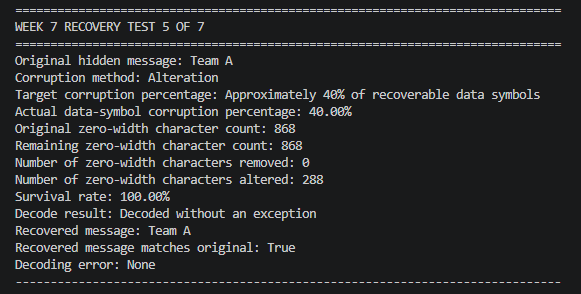
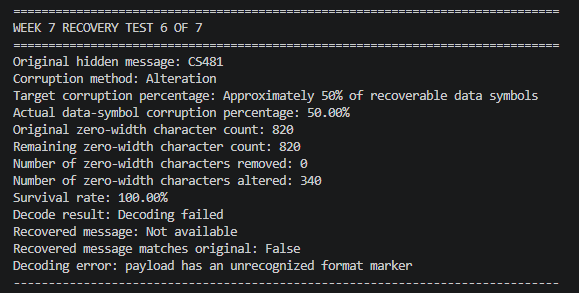
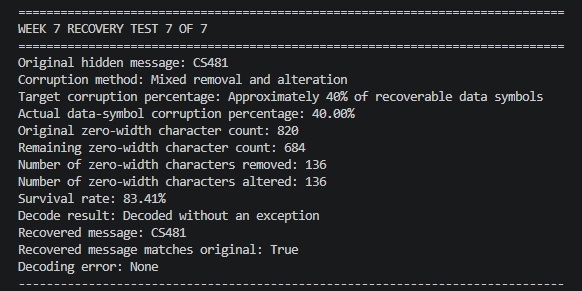

# Week 7 Tristan Expanded Recovery Testing Results

## Objective

The objective of Week 7 recovery testing is to determine how the improved zero-width Unicode steganography codec performs under higher levels of controlled corruption and to identify the recovery behavior of the five-copy recovery method as corruption increases.

The Week 5 recovery-testing results established a baseline in which the original codec failed to recover hidden messages after the tested zero-width character corruption scenarios. Week 6 testing evaluated the improved five-copy recovery codec at lower corruption levels and successfully recovered all six tested messages.

Week 7 expands the controlled corruption testing to higher levels to further evaluate recovery behavior under more severe corruption.

Week 7 testing evaluates the improved codec under seven controlled corruption scenarios:

* Approximately 40% zero-width character removal
* Approximately 50% zero-width character removal
* Approximately 60% zero-width character removal
* Approximately 30% zero-width character alteration
* Approximately 40% zero-width character alteration
* Approximately 50% zero-width character alteration
* Approximately 40% mixed zero-width character removal and alteration

## Test Messages

The Week 7 recovery tests reused the same messages from the Week 6 recovery testing so that the results could be compared with the previous week's testing.

1. `Hello` — reused from the Week 6 recovery tests.
2. `Zero Width Test` — reused from the Week 6 recovery tests.
3. `CS481 Test 123!` — reused from the Week 6 recovery tests.
4. `This is a longer test message for Week 3.` — reused from the Week 6 recovery tests.
5. `Team A` — reused from the Week 6 recovery tests.
6. `CS481` — reused from the Week 6 recovery tests.

The `CS481` message was used for both the 50% alteration test and the 40% mixed corruption test.

## Test Procedure

1. Use the existing five-copy recovery implementation from the Week 6 version of the zero-width Unicode codec.

2. Create an encoded hidden message using the recovery-enabled codec with a repetition factor of five.

3. Apply controlled corruption to the encoded zero-width data while preserving the structural separator characters required by the recovery decoder.

4. Run the seven Week 7 recovery scenarios:

   * Approximately 40% zero-width character removal.
   * Approximately 50% zero-width character removal.
   * Approximately 60% zero-width character removal.
   * Approximately 30% zero-width character alteration.
   * Approximately 40% zero-width character alteration.
   * Approximately 50% zero-width character alteration.
   * Approximately 40% mixed removal and alteration.

5. Decode each corrupted payload using the recovery-enabled decoder.

6. Record the target and actual corruption percentage, original and remaining zero-width character counts, number of characters removed or altered, survival rate, decode result, recovered message, whether the recovered message matches the original, and any decoding error.

7. Capture a screenshot of the terminal output for each test as evidence.

8. Compare the Week 7 recovery results with the Week 5 baseline and Week 6 recovery results.

The seven recovery tests were executed from the repository root using:

`python tests/week7_testing/run_tristan_expanded_recovery_tests.py`

The script performed the controlled corruption, recovery, and result reporting for each assigned test scenario.

## Information Recorded for Each Test

For each Week 7 recovery test, the following information was recorded:

* Test number.
* Original hidden message.
* Corruption method.
* Target corruption percentage.
* Actual data-symbol corruption percentage.
* Original zero-width character count.
* Remaining zero-width character count.
* Number of zero-width characters removed.
* Number of zero-width characters altered.
* Survival rate.
* Decode result.
* Recovered message.
* Whether the recovered message matched the original message.
* Any decoding error reported by the decoder.
* Screenshot evidence of the terminal output.

---

## Test Results

### Test 1 — 40% Zero-Width Character Removal

**Original hidden message:** `Hello`

**Corruption:** 40.00% of recoverable data symbols removed

**Zero-width characters:** 820 original → 548 remaining

**Characters removed:** 272

**Survival rate:** 66.83%

**Recovery result:** PASS

**Recovered message:** `Hello`

*Figure 1. Terminal evidence for Test 1. The controlled corruption removed 272 zero-width characters, resulting in a 66.83% survival rate. Despite the corruption, the recovery decoder successfully recovered `Hello`, and the recovered message matched the original.*

### Test 2 — 50% Zero-Width Character Removal

**Original hidden message:** `Zero Width Test`

**Corruption:** 50.00% of recoverable data symbols removed

**Zero-width characters:** 1,300 original → 760 remaining

**Characters removed:** 540

**Survival rate:** 58.46%

**Recovery result:** FAIL

**Recovered message:** Not available

**Decoding error:** `recovery payload contains a missing or malformed bit group`

*Figure 2. Terminal evidence for Test 2. The controlled corruption removed 540 zero-width characters, resulting in a 58.46% survival rate. The recovery decoder could not recover the hidden message and reported a missing or malformed bit group.*

### Test 3 — 60% Zero-Width Character Removal

**Original hidden message:** `CS481 Test 123!`

**Corruption:** 60.00% of recoverable data symbols removed

**Zero-width characters:** 1,300 original → 652 remaining

**Characters removed:** 648

**Survival rate:** 50.15%

**Recovery result:** FAIL

**Recovered message:** Not available

**Decoding error:** `recovery payload contains a missing or malformed bit group`

*Figure 3. Terminal evidence for Test 3. The controlled corruption removed 648 zero-width characters, resulting in a 50.15% survival rate. The recovery decoder could not recover the hidden message and reported a missing or malformed bit group.*

### Test 4 — 30% Zero-Width Character Alteration

**Original hidden message:** `This is a longer test message for Week 3.`

**Corruption:** 30.00% of recoverable data symbols altered

**Zero-width characters:** 2,548 original → 2,548 remaining

**Characters altered:** 636

**Survival rate:** 100.00%

**Recovery result:** PASS

**Recovered message:** `This is a longer test message for Week 3.`

*Figure 4. Terminal evidence for Test 4. The controlled corruption altered 636 zero-width characters while removing none, resulting in a 100.00% survival rate. Despite the corruption, the recovery decoder successfully recovered the original message, and the recovered message matched the original.*

### Test 5 — 40% Zero-Width Character Alteration

**Original hidden message:** `Team A`

**Corruption:** 40.00% of recoverable data symbols altered

**Zero-width characters:** 868 original → 868 remaining

**Characters altered:** 288

**Survival rate:** 100.00%

**Recovery result:** PASS

**Recovered message:** `Team A`

*Figure 5. Terminal evidence for Test 5. The controlled corruption altered 288 zero-width characters while removing none, resulting in a 100.00% survival rate. Despite the corruption, the recovery decoder successfully recovered `Team A`, and the recovered message matched the original.*

### Test 6 — 50% Zero-Width Character Alteration

**Original hidden message:** `CS481`

**Corruption:** 50.00% of recoverable data symbols altered

**Zero-width characters:** 820 original → 820 remaining

**Characters altered:** 340

**Survival rate:** 100.00%

**Recovery result:** FAIL

**Recovered message:** Not available

**Decoding error:** `payload has an unrecognized format marker`

*Figure 6. Terminal evidence for Test 6. The controlled corruption altered 340 zero-width characters while removing none, so the zero-width character survival rate remained 100.00%. However, the recovery decoder could not recover the hidden message and reported an unrecognized format marker.*

### Test 7 — 40% Mixed Removal and Alteration

**Original hidden message:** `CS481`

**Corruption:** 40.00% of recoverable data symbols corrupted through mixed removal and alteration

**Zero-width characters:** 820 original → 684 remaining

**Characters removed:** 136

**Characters altered:** 136

**Survival rate:** 83.41%

**Recovery result:** PASS

**Recovered message:** `CS481`

*Figure 7. Terminal evidence for Test 7. The controlled corruption removed 136 zero-width characters and altered another 136, resulting in an 83.41% survival rate. Despite the mixed corruption, the recovery decoder successfully recovered `CS481`, and the recovered message matched the original.*

---

# Week 7 Recovery Testing Comparison

**## Purpose**

The Week 5 recovery-testing results established the baseline for the original codec, while Week 6 demonstrated successful recovery using the improved five-copy recovery method under lower corruption levels. Week 7 expanded the testing to higher corruption levels to evaluate how recovery behavior changed as corruption increased.

## Week 5 Baseline

The Week 5 recovery tests established a baseline in which the previous codec failed to recover the hidden message in each of the four tested corruption scenarios.

| Test | Hidden Message                              | Corruption Scenario          | Result            |
| ---- | ------------------------------------------- | ---------------------------- | ----------------- |
| 1    | `Hello`                                     | 30% removal                  | **Decode failed** |
| 2    | `Zero Width Test`                           | 50% removal                  | **Decode failed** |
| 3    | `CS481 Test 123!`                           | 30% alteration               | **Decode failed** |
| 4    | `This is a longer test message for Week 3.` | 20% removal + 20% alteration | **Decode failed** |

All four Week 5 recovery scenarios resulted in decode failure.

## Week 6 Results

Week 6 tested the improved five-copy recovery codec under lower corruption levels.

| Test | Hidden Message                              | Corruption Scenario            | Survival Rate | Result   |
| ---- | ------------------------------------------- | ------------------------------ | ------------: | -------- |
| 1    | `Hello`                                     | 10% removal                    |        91.71% | **PASS** |
| 2    | `Zero Width Test`                           | 20% removal                    |        83.38% | **PASS** |
| 3    | `CS481 Test 123!`                           | 30% removal                    |        75.08% | **PASS** |
| 4    | `This is a longer test message for Week 3.` | 10% alteration                 |       100.00% | **PASS** |
| 5    | `Team A`                                    | 20% alteration                 |       100.00% | **PASS** |
| 6    | `CS481`                                     | 30% mixed removal + alteration |        87.56% | **PASS** |

All six Week 6 recovery scenarios successfully recovered their original hidden messages.

## Week 7 Results

Week 7 expanded the controlled corruption levels beyond those tested in Week 6.

| Test | Hidden Message                              | Corruption Scenario            | Survival Rate | Result   |
| ---- | ------------------------------------------- | ------------------------------ | ------------: | -------- |
| 1    | `Hello`                                     | 40% removal                    |        66.83% | **PASS** |
| 2    | `Zero Width Test`                           | 50% removal                    |        58.46% | **FAIL** |
| 3    | `CS481 Test 123!`                           | 60% removal                    |        50.15% | **FAIL** |
| 4    | `This is a longer test message for Week 3.` | 30% alteration                 |       100.00% | **PASS** |
| 5    | `Team A`                                    | 40% alteration                 |       100.00% | **PASS** |
| 6    | `CS481`                                     | 50% alteration                 |       100.00% | **FAIL** |
| 7    | `CS481`                                     | 40% mixed removal + alteration |        83.41% | **PASS** |

Four of the seven Week 7 recovery scenarios successfully recovered their original hidden messages, while three scenarios resulted in decoding failure.

## Comparison

The Week 6 results showed successful recovery at 10%, 20%, and 30% removal, as well as 10% and 20% alteration and 30% mixed corruption.

Week 7 increased the corruption levels and showed that recovery behavior changed as the amount of corruption increased. The 40% removal test still successfully recovered its message, while the 50% and 60% removal tests failed to recover their messages.

For alteration, the improved codec successfully recovered the messages at 30% and 40% alteration. At 50% alteration, the decoder failed with an unrecognized format marker even though the zero-width character survival rate remained 100.00%.

The 40% mixed removal-and-alteration test successfully recovered its original message, with 136 characters removed and another 136 characters altered.

These results provide additional evidence about the recovery behavior of the five-copy method under higher controlled corruption levels. They also show that zero-width character survival rate alone does not determine whether recovery will succeed. In particular, the 50% alteration test retained all zero-width characters but still failed to decode because the contents of the characters had been corrupted.

## Overall Result

Week 7 testing expanded the corruption levels beyond the Week 6 scenarios and produced both successful recoveries and decoding failures.

The improved five-copy recovery codec successfully recovered the hidden messages in four of the seven Week 7 scenarios:

* 40% removal.
* 30% alteration.
* 40% alteration.
* 40% mixed removal and alteration.

The codec failed to recover the hidden messages in three scenarios:

* 50% removal.
* 60% removal.
* 50% alteration.

The Week 7 results provide evidence of the recovery behavior of the five-copy method under higher controlled corruption levels and help identify conditions where the current recovery approach no longer successfully reconstructs the original hidden message.
