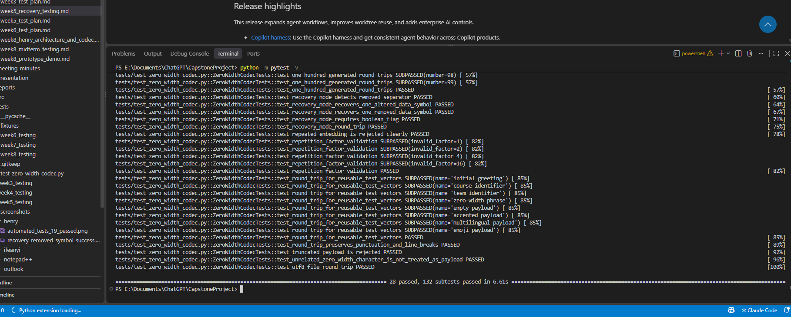
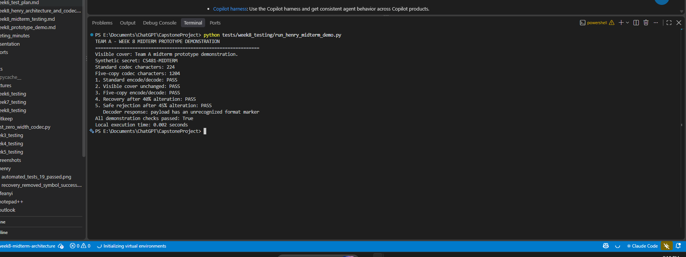

# Henry Smith - Week 8 Midterm Demo Results

## Objective

Verify the current codec architecture and prepare a short, reproducible,
network-independent prototype demonstration for the Midterm Report.

## Automated regression result

Command:

```powershell
python -m pytest -v
```

Verified result:

- 28 tests passed.
- 132 subtests passed.
- No failures were reported.

## Prototype demonstration result

Command:

```powershell
python tests/week8_testing/run_henry_midterm_demo.py
```

| Demonstration check | Result |
| --- | --- |
| Standard encode/decode | PASS |
| Visible cover remains unchanged | PASS |
| Five-copy encode/decode | PASS |
| Recovery after 40% distributed alteration | PASS |
| Safe rejection after 45% distributed alteration | PASS |

The demo used the synthetic secret `CS481-MIDTERM`. Standard mode contained
224 codec characters, while five-copy protected mode contained 1,204. This
illustrates the recovery-versus-overhead tradeoff. The complete verified output
is preserved in `henry_midterm_demo_output.txt` as an offline fallback.

## Interpretation

The demonstration confirms the complete local data flow: framing, zero-width
mapping, cover preservation, decoding, integrity validation, protected-mode
recovery within the supported limit, and explicit rejection beyond the limit.

The successful 40% result does not imply universal platform compatibility.
It applies to controlled, distributed data-symbol alteration with structural
separators intact. A platform that strips the entire payload remains
unrecoverable.

## Screenshot evidence

### Complete regression suite



This screenshot verifies that the merged codec and recovery implementation
passes all 28 tests and 132 subtests without a failure.

### Midterm prototype demonstration



This screenshot shows all five demonstration checks passing. It verifies the
standard round trip, unchanged visible cover, five-copy round trip, recovery
after 40% distributed alteration, and safe rejection after 45% alteration.

These images should also be linked and explained in the final Midterm Report.
